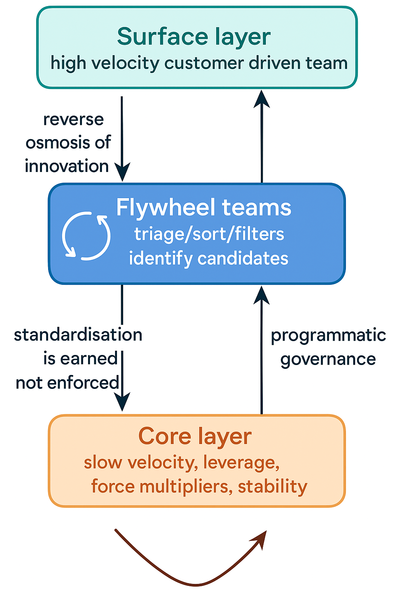

# The Fluid Organisation: A Flywheel of Flow

A whitepaper on designing organisations as dynamic, layered systems—built around coherence, not control.

---

## 🌀 Overview

Most companies push for uniform motion—synchronised delivery cadences across teams, technologies, and products. The result is friction, burnout, and brittle systems.

**The Fluid Organisation** introduces a three-layered architecture:

- **Surface**: High-velocity, exploration-focused product teams  
- **Core**: Stable, reusable infrastructure and platforms  
- **Flywheel**: The dynamic enablement layer that absorbs, filters, and transduces signal into capability

  

This model draws on engineering metaphors (CVT, hydrodynamics, mantle convection) and applies systems thinking principles to organisational flow.

---

## 🔍 Inside the Whitepaper

- Why uniform velocity fails and layered motion matters  
- The role of the Flywheel as a transduction system  
- Metrics for coherence: Org Re, Shear Index, Absorption Ratio
- Identified Design Patterns
- Scenarios, playbooks, and triage mechanics  
- Visual models and feedback loops  
- A conclusion grounded in Donella Meadows’ thinking

---

## 📄 File List

- `The Fluid Organisation_ A Flywheel of Flow.pdf` – Full V1 whitepaper
- `main.tex` the new working latex file 
- `diagrams/` – Supporting visuals: flow model, metric maps  
- `README.md` – This file

---
## ⚙️ Use Latex to compile the Main file

Compile the latex file using the following command

```latexmk -pdf -outdir=out main.tex```

---

## ✍️ Author

Marc Daniel Ortega  
© 2025 – All rights reserved

---

## 💬 Share or Cite

If you reference the model, please credit the author.  
If you’re applying or adapting the theory in your organisation, I would love to hear how.
